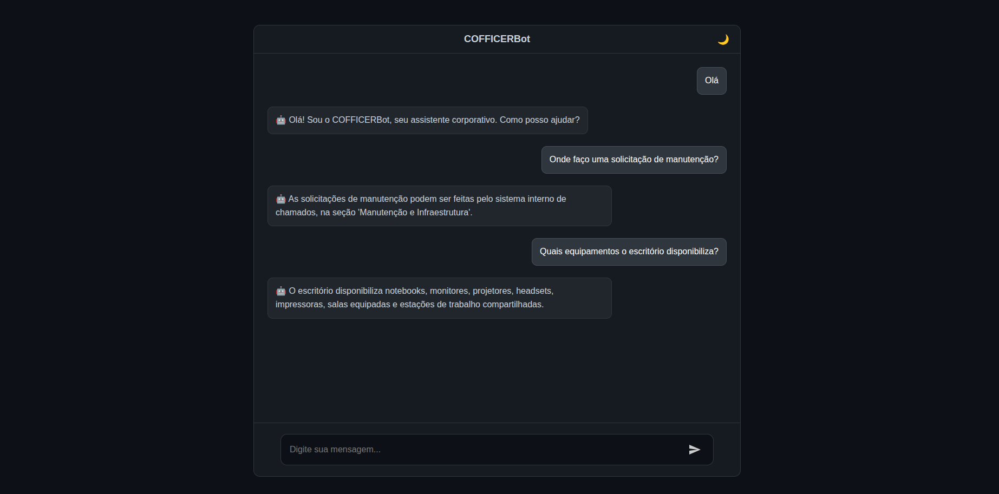

# 🤖 COFFICERBot: ChatBot para escritório corporativo 💼

O COFFICERBot é um ChatBot assistente desenvolvido para o ambiente corporativo, focado em responder dúvidas comuns e fornecer informações essenciais para o dia a dia do escritório.



<br>

## ⚙️ Funcionalidades

1. Recebe perguntas dos usuários
2. Retorna respostas armazenadas na base de dados.

Abaixo estão alguns exemplos de questões que o COFFICERBot é capaz de reconhecer e responder:

- **Agendamentos**: "como posso agendar reuniões?"
- **Horários de funcionamento**: "qual o horário de funcionamento?"
- **Serviços oferecidos**: "o que o assistente virtual faz?"
- **Manutenção**: "como solicitar manutenção?"
- **Equipamentos disponíveis**: "quais equipamentos o escritório disponibiliza?"
- **Reserva de salas**: "como reservar uma sala de reunião?"
- **Setores do escritório**: "onde ficam os setores do escritório?"
- **Solicitação de materiais**: "como solicitar materiais de escritório?"
- **Visitantes**: "como recebo visitantes?"
- **Eventos**: "onde encontro o calendário de eventos da empresa?"
- **Férias**: "como solicitar férias?"
- **Ajuda geral**: "como você pode me auxiliar?

<br>

## 🚀 Guia de Configuração Local

### 📋 Pré-requisitos

* **Python 3.x**
* **Node.js e npm**


### Configuração do Backend (Python)
1 -  Clone o repositório, utilizando o comando:
```bash
   git clone https://github.com/sarahzxwy/chatbot-cofficerbot.git
   ```
2 - Navegue para o diretório do projeto:

```bash
    cd chatbot-cofficerbot
   ```

3 - Crie e ative um ambiente virtual (recomendado):

Para Windows:
```bash
   python -m venv venv
   venv\Scripts\activate
   ```
Para Linux ou macOS:
```bash
   python -m venv venv
   source venv/bin/activate
   ```
4 - Instale as dependências do projeto, utilizando o comando:
```bash
   pip install -r requirements.txt
   ```

5 -  Renomeie o arquivo `.env.example` para `.env` e preencha com os caminhos dos arquivos exigidos. Exemplo:
```env
    INFORMACOES="caminho do informacoes.json" 
    SAUDACOES="caminho do saudacoes.json"
 ```

6 - Execute os arquivos de testes (recomendado)

<br>

### Configuração do Frontend (Node.js)
7 - Navegue para a pasta do frontend (`chat`):
```bash
   cd chat
   ```
8 - Instale as dependências do Node.js:
```bash
   npm install
   ```

<br>

### Execução do Projeto
Para que o chat bot funcione, você precisa executar o serviço de API (backend) e a interface do chat (frontend) em terminais separados.

9 - No primeiro terminal (certifique-se de que o ambiente virtual está ativado e que você está no diretório raiz do projeto), execute o script de serviço:
```bash
   python servico.py
   ```

10 - Em um segundo terminal (certifique-se de estar dentro da pasta `chat`), inicie a interface:
```bash
   npm run start
   ```


11 - Acesse o chatbot no seu navegador: http://localhost:3000/

<br>

## 📂 Estrutura de Código

 - `robo.py`: Arquivo principal que configura o chatbot usando ChatterBot.

 - `servico.py`: API Flask que recebe mensagens via HTTP, processa com o robo.py e devolve respostas em JSON.

 - `treinamento.py`: Responsável por treinar o chatbot carregando os arquivos JSON de perguntas/respostas (informacoes.json e saudacoes.json) e os envia para o ChatterBot aprender.

- `informacoes.json`: Base de conhecimento do robô para informações corporativas.

- `saudacoes.json`: Base de conhecimento do robô para saudações.

- `testar_informacoes.py`: Arquivo de testes automatizados (unittest) focado nas respostas de informações corporativas.

- `testar_saudacoes.py`: Arquivo de testes automatizados (unittest) focado nas saudações.

- `index.js`: Backend da aplicação web.

- `index.html`:  Interface do chatbot.

<br>


## 💻 Tecnologias Utilizadas

- **Python 3**: Linguagem principal utilizada no desenvolvimento do chatbot.  
- **python-dotenv**: Leitura de variáveis de ambiente para configuração do sistema.  
- **ChatterBot**: Biblioteca de inteligência artificial responsável por gerar respostas com base no treinamento.  
- **Flask**: Framework web utilizado para criar a API que comunica com outras aplicações.  
- **JSON**: Formato utilizado para armazenar e estruturar as bases de conhecimento do bot (perguntas e respostas).  
- **Unittest (Python)**: Biblioteca padrão para criar testes automatizados e garantir o comportamento correto do chatbot.  
- **Node.js**: Ambiente JavaScript utilizado para executar o backend que integra o chat ao servidor.  
- **Socket.io**: Garante comunicação em tempo real entre o frontend e o backend.  
- **HTML5**: Estrutura visual da interface do chat.  
- **CSS3**: Estilização e design da interface do usuário.  
- **JavaScript (Frontend)**: Envia e recebe mensagens do servidor, exibindo a conversa na interface.

<br>


## 👩🏻‍💻 Autora

[Sarah Alves Borges](https://github.com/sarahzxwy)
